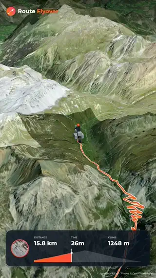
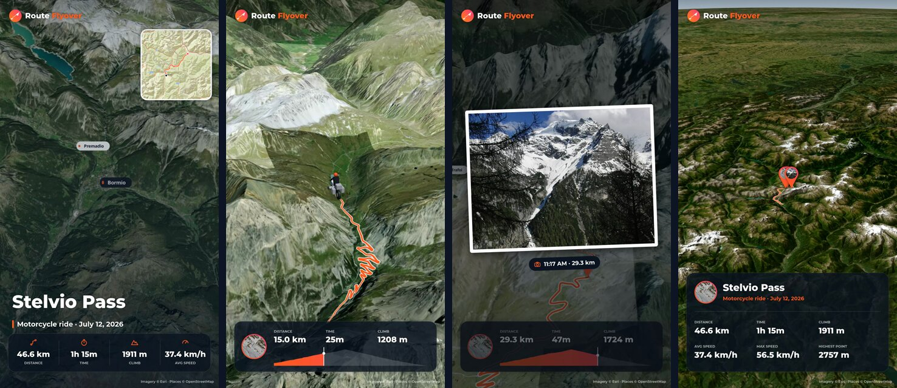
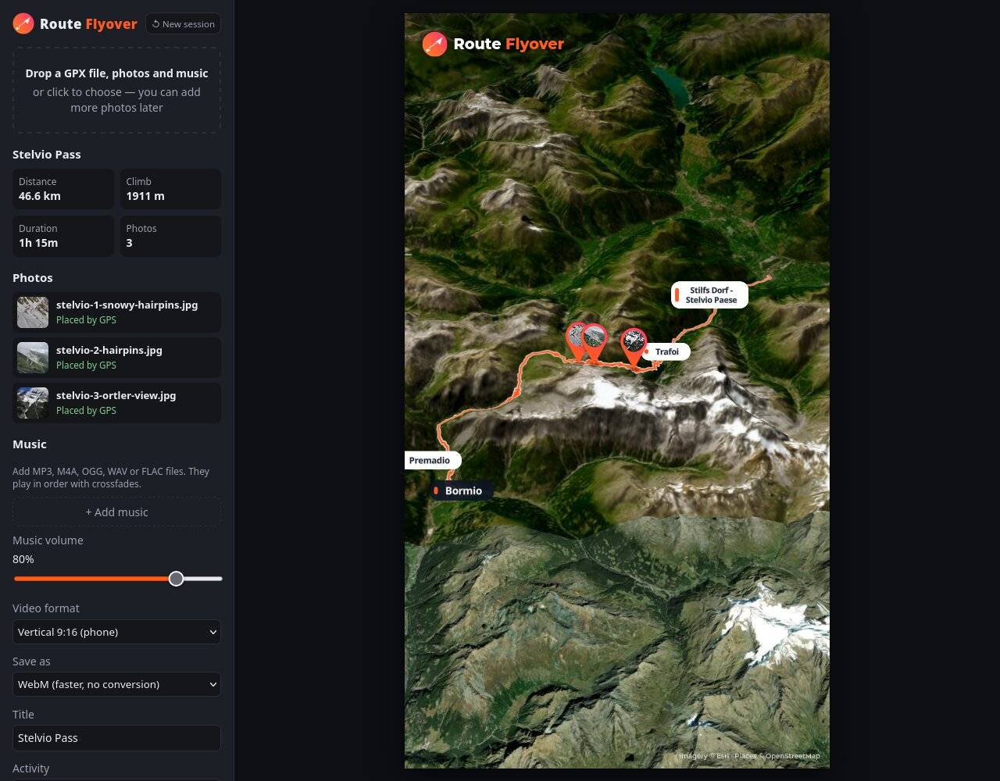

# Route Flyover

**Turn a GPX track, your photos and your music into a 3D fly-over video of your trip.**

Route Flyover is a personal web app that runs on your own computer. Drop in a GPX file from your
ride, hike or drive, add the photos you took along the way and a few songs, and it flies a
camera along your route over satellite imagery and real 3D terrain. It stops at every photo,
shows live distance / time / climb, ends with a zoom-out to the curve of the Earth and a
statistics card, and renders the whole thing as a video ready for Instagram, WhatsApp or
your phone.

Nothing is uploaded anywhere: your GPX, photos, music and the finished video stay on your
machine. The only network traffic is fetching public map tiles.

<p align="center">
  
</p>

<p align="center">
  
</p>

<p align="center"><em>From the included demo trip over the Stelvio Pass — vertical 1080×1920 video.</em></p>



**Try it in a minute:** start the app (see [Installation](#installation)), then drop all files
from [`samples/`](samples/) onto it — a ride over the Stelvio Pass with three photos.

---

## Contents

- [Features](#features)
- [Requirements](#requirements)
- [Installation](#installation)
- [Running Route Flyover](#running-route-flyover)
- [Hosting it online (optional)](#hosting-it-online-optional)
- [How to use it](#how-to-use-it)
- [Settings reference](#settings-reference)
- [How things work](#how-things-work)
- [Supported files](#supported-files)
- [Tips for good videos](#tips-for-good-videos)
- [Troubleshooting](#troubleshooting)
- [Project structure](#project-structure)
- [Map data, fonts and attribution](#map-data-fonts-and-attribution)
- [Changelog](#changelog)
- [License](#license)

---

## Features

**Route and map**
- 3D satellite map with real terrain (adjustable exaggeration) and a globe with atmosphere.
- Reads GPX tracks or routes with elevation and timestamps; computes distance, total and
  moving time, average and max speed, climb, descent, highest and lowest point.
- Town and village names along your route, taken from OpenStreetMap (only places near the
  route are labelled, like a travel log).
- Elevation profile you can click to jump anywhere along the route.

**The video**
- Vertical 9:16 (1080×1920, for phones and Reels) or landscape 16:9 (1920×1080).
- Intro card with a route mini-map, headline stats, title and subtitle, then the camera
  dives in.
- High chase camera that follows the route smoothly, with the ridden part of the trail drawn
  behind a rider marker: a dot, or a small 3D model — car with roof luggage, GS-style adventure
  motorcycle, two motorcycles or a bicycle — that turns with the road and is seen in
  perspective, just like the map.
- Photo pins along the route; at each one the flight pauses and the photo is shown as a print
  with time and distance.
- Bottom card with your profile picture, live distance / time / climb and the elevation profile.
- Closing zoom-out to the whole route and a summary card with the trip statistics.
- Background music: several songs played in order with crossfades, cut to the video length
  with a smooth fade-out — always at normal speed.
- Frame-by-frame rendering with a progress bar: the video is always perfectly smooth at
  30 fps and exactly as long as the timeline, however fast your computer or connection is.
- Preview the finished video in the app, then save it as MP4 (H.264 + AAC, constant 30 fps —
  what Instagram and WhatsApp want) or WebM. MP4 conversion uses your NVIDIA GPU when available.
- *New session* clears the trip in one click and keeps your settings for the next video.

**Photos**
- JPEG, PNG, WebP and iPhone HEIC/HEIF.
- Placed on the route by their GPS position, or by the time they were taken.
- Copies of the same photo (`IMG_1234.HEIC`, `IMG_1234.jpg`, …) are merged automatically.
- A list shows how every photo was placed or why it couldn't be.

---

## Requirements

| What | Version | Why |
|---|---|---|
| **Node.js** | 20.19+ or 22.12+ (tested with 26) | runs the local app server (Vite) |
| **npm** | comes with Node.js | installs dependencies |
| **ffmpeg** with `libx264` and `aac` | any recent version (tested with 9.0) | converts rendered videos to MP4 — only needed for the MP4 option |
| **Browser** | current Firefox or Chrome/Chromium | runs the app; needs WebGL 2 |
| **Graphics** | any GPU with working WebGL 2 | 3D map rendering |
| **NVIDIA GPU** *(optional)* | driver + ffmpeg with `h264_nvenc` | ~2.4× faster MP4 conversion; without it the CPU is used |
| **Internet** | while using the app | satellite imagery, terrain and place names are streamed |

Check what you have:

```bash
node --version
npm --version
ffmpeg -hide_banner -encoders | grep -E "libx264|aac|h264_nvenc"   # h264_nvenc only with NVIDIA
```

### Installing the requirements

New to Linux? Follow the **[step-by-step Linux guide](docs/INSTALL-LINUX.md)** (Debian/Ubuntu,
Fedora, Arch); the short version is below.

**Arch / CachyOS / Manjaro**
```bash
sudo pacman -S nodejs npm ffmpeg
```

**Debian / Ubuntu**
```bash
sudo apt install ffmpeg
# Distribution Node.js is often too old; install a current one, e.g. via NodeSource or nvm:
curl -o- https://raw.githubusercontent.com/nvm-sh/nvm/v0.40.3/install.sh | bash
nvm install --lts
```

**Fedora**
```bash
sudo dnf install nodejs npm
# ffmpeg with libx264 comes from RPM Fusion (Fedora's own ffmpeg-free lacks it):
sudo dnf install https://mirrors.rpmfusion.org/free/fedora/rpmfusion-free-release-$(rpm -E %fedora).noarch.rpm
sudo dnf swap ffmpeg-free ffmpeg --allowerasing
```

**macOS** (with [Homebrew](https://brew.sh))
```bash
brew install node ffmpeg
```
New to the Mac Terminal? See the **[step-by-step macOS guide](docs/INSTALL-MAC.md)**
(Apple Silicon and Intel).

**Windows**
Install Node.js LTS from <https://nodejs.org> and ffmpeg (e.g. `winget install Gyan.FFmpeg`),
and make sure `ffmpeg` is on your `PATH`. See the
**[step-by-step Windows guide](docs/INSTALL-WINDOWS.md)** for details. Or let the installer
script do everything (requirements, download, `npm install`, start) from PowerShell:
```powershell
irm https://raw.githubusercontent.com/topke63/RouteFlyover/main/install-windows.ps1 | iex
```
or double-click `install-windows.bat` in a downloaded copy
([details](docs/INSTALL-WINDOWS.md#quick-install-automatic)).

---

## Installation

```bash
git clone https://github.com/topke63/RouteFlyover.git
cd RouteFlyover
npm install
```

That's all — no API keys or accounts are needed.

---

## Running Route Flyover

### For everyday use

```bash
npm run dev
```

Then open **<http://localhost:5173>** in Firefox or Chrome. Keep the terminal open while you
use the app; stop it with `Ctrl+C`.

To use a different port: `npm run dev -- --port 5199`.

### Optimized build

```bash
npm run build      # creates dist/
npm run preview    # serves dist/ on http://localhost:4173, including MP4 conversion
```

> **MP4 conversion needs the Route Flyover server** (`npm run dev` or `npm run preview`), because it
> uses your system's ffmpeg. If you host the contents of `dist/` on a plain web server instead,
> everything else works, and MP4 conversion falls back to the browser — which works in
> Chrome but not in Firefox on Linux (Firefox can't encode H.264/AAC there). WebM always works.

---

## Hosting it online (optional)

Route Flyover can also run as a website, so you and friends can use it from any computer —
e.g. on **Cloudflare Workers**, which serves the app's files for free. Everything still runs in
each visitor's browser; nothing is uploaded.

1. Create a free Cloudflare account and log in once: `npx wrangler login`.
2. In [`wrangler.jsonc`](wrangler.jsonc), set `"name"` to your own Worker name and keep
   `"workers_dev": false` for now, so the site isn't reachable yet.
3. **Get a free ArcGIS API key** (needed for a public site, see below): create an
   [ArcGIS Location Platform](https://location.arcgis.com/) account (no credit card needed),
   then create an API key with the **Basemaps** and **Static basemap tiles** privileges, and
   under *Referrers* allow only your site (e.g. `https://route-flyover.example.com`). Put it
   in a file `.env.local` next to `package.json` (it's git-ignored):
   ```bash
   VITE_ARCGIS_KEY=your-key-here
   ```
   The key ends up in the site's JavaScript — that's normal for map keys; the referrer
   restriction is what stops other sites from using it. Without a card on the account, the
   free monthly allowance can't turn into a bill: past it, imagery stops until next month.
4. **Create the map-tile counter's database** (Cloudflare D1, free tier). With a key, the
   sidebar shows everyone roughly how many renders the free Esri allowance has left this month:
   ```bash
   npx wrangler d1 create route-flyover-usage    # put the printed database_id in wrangler.jsonc
   npx wrangler d1 migrations apply route-flyover-usage --remote
   ```
   The count is an estimate from what each visitor's browser reports, per calendar month (UTC);
   Esri's own usage page in your ArcGIS account is the exact figure and may reset on a
   different day.
5. Build and upload:
   ```bash
   npm run build && npx wrangler deploy
   ```
6. **Only without an API key: put a login in front of it** with Cloudflare Access (free for up to
   50 people), because the public Esri tile servers are meant for personal use (see
   [Map data, fonts and attribution](#map-data-fonts-and-attribution)). Enable Zero Trust in the
   Cloudflare dashboard, then **Workers & Pages → your Worker → Access → Protect this Worker behind
   Access → All traffic** with a policy for yourself (*Cloudflare account*) and/or your friends
   (*Emails*, with **One-time PIN** login).
7. Set `"workers_dev": true`, deploy again, and open `https://<name>.<your-subdomain>.workers.dev`.
   With a key, the site is public; without one, it should ask for the login first.

With a key, imagery and the intro mini-map come from Esri's key-based services and count against
your account's free allowance; when running locally without `.env.local`, the public servers are
used as before. Online, MP4 conversion happens in the browser (Chrome yes, Firefox no —
there it saves WebM), because there's no ffmpeg server.

---

## How to use it

1. **Add your trip.** Drag a `.gpx` file onto the page (or click the drop area). The route
   appears on the map with its distance, climb and duration.
2. **Add photos.** Drag them in with the GPX or later. Pins appear on the route; the *Photos*
   list says how each one was placed (GPS or time) or why not.
3. **Add music** (optional). Drag songs in, or use *+ Add music*. The list shows each song and
   whether the music will be cut to fit or repeated.
4. **Set it up** in the sidebar: format, title, activity, subtitle, rider marker, profile
   photo, flight length, camera height and so on (see below).
5. **Preview** with **▶ Play**. Pause any time; click the elevation profile in the frame to
   jump. Music plays along in the preview.
6. **Render** with **🎬 Render video**. A progress bar shows each stage — *Rendering frames*,
   *Adding music*, *Converting to MP4* — with the elapsed time and an estimate of the time
   left. Keep the tab visible while it renders; **Cancel** stops it at any point.
7. **Watch and save.** The finished video appears in the sidebar with a player, its file
   name and size. Click **💾 Save video**: Chrome asks where to save it; Firefox saves it
   through its normal download (to your Downloads folder, or asks, depending on your Firefox
   settings). **Discard** throws it away.
8. **Start the next video** with **↺ New session** (top of the sidebar). It clears the route,
   photos, music, titles and any unsaved video, and keeps your preferences — format, camera,
   rider marker, profile photo, flight settings, volume. It asks first if a render is running
   or a finished video hasn't been saved.

Rendering takes longer than the video it produces, because every frame waits until the map
imagery is sharp — the waiting never shows up in the video. Expect roughly 1.5–2× the video
length, plus a short MP4 conversion at the end.

A demo trip is included in `samples/`: drop all its files in at once — a 46.7 km ride over the
Stelvio Pass with three photos (credits in [`samples/CREDITS.md`](samples/CREDITS.md)).

---

## Settings reference

| Setting | What it does |
|---|---|
| **Save as** | *MP4* (H.264/AAC, for Instagram, WhatsApp, phones) or *WebM* (no conversion, faster). |
| **Video format** | *Vertical 9:16* (1080×1920) or *Landscape 16:9* (1920×1080). The preview frame matches. |
| **Title** | Big headline in the intro and on the summary card. Defaults to the GPX track name. |
| **Activity** | Used in the default subtitle and to pick a matching rider marker. |
| **Rider marker** | Dot, or a 3D car, motorcycle (GS-style adventure bike), two motorcycles or bicycle. |
| **Subtitle** | Line under the title. Defaults to *activity · date*. |
| **Profile photo** | Picture in the round avatar. Defaults to your first placed photo. |
| **Flight length** | How long the flight along the route takes (1–15 min). Set automatically from the route length; photo stops, intro and ending come on top. |
| **Camera** | Low, medium or high chase camera. Higher shows more landscape and loads faster. |
| **Terrain exaggeration** | Makes hills and mountains taller (1×–2.5×). |
| **Photo duration** | How long each photo is shown. |
| **Camera clock offset** | For photos without GPS: hours your camera's clock was ahead of the real local time (e.g. a camera still on another time zone). |
| **Music volume** | Loudness of the music in the preview and the video. |

The **estimated video length** is shown in the Music section: intro (~7 s) + flight length +
one photo duration per photo + zoom-out (5 s) + summary (7 s).

---

## How things work

### Photo placement
1. If the photo has a GPS position within 2 km of the route, it's pinned to the nearest point.
2. Otherwise, if it has a capture time inside the recording's time span (± 30 min), it's
   placed where you were at that time. Time zones are taken from the photo when the camera
   stored them; otherwise use the *camera clock offset* setting.
3. Converted copies (screenshots, re-saved JPEG/PNG) usually lost their GPS and time. Keep the
   originals — if both are dropped in, Route Flyover uses the metadata of whichever copy has it.

### Music
- Songs play in the order you added them, at normal speed, with 2-second crossfades.
- If the music is longer than the video, it's cut and faded out over the last ~4 seconds.
- If it's shorter, the playlist starts again from the first song.
- The video itself is rendered silently; once it's finished and its exact length is known,
  the soundtrack is rendered to exactly that length and added to the file (the video is copied,
  not re-compressed). This keeps music and picture perfectly in sync.

### Rendering
Route Flyover doesn't film the screen. It advances the animation by exactly 1/30 s, waits until
the map has loaded everything for that moment, draws the map and the overlay, and encodes
that picture as the next frame (VP8, via WebCodecs). Each frame is stamped with its exact
time, so the video is perfectly smooth and exactly as long as the timeline — slow tiles or a
slow computer only make rendering take longer.

### MP4 export
Rendering produces WebM. With *Save as MP4*, the finished file is sent to the local Route Flyover
server, which converts it with ffmpeg (reporting real progress) and returns the MP4. The data
only travels between your browser and your own computer.

**NVIDIA GPU acceleration.** If your ffmpeg has `h264_nvenc` and an NVIDIA card is usable, the
video is encoded on the GPU — about 2.4× faster (an 88 s video: ~9 s instead of ~20 s on an
RTX 5060 Ti) at the same picture quality and file size. Route Flyover checks this with a tiny test
encode; without a usable NVIDIA GPU, or if the GPU fails during a job (for example when another
program has filled its memory), it converts on the CPU instead. The progress bar shows which one
is used: *Converting to MP4 (NVIDIA GPU)* or *(CPU)*. The two settings are:

```
# NVIDIA GPU
ffmpeg -i input -c:v h264_nvenc -preset p5 -tune hq -rc vbr -cq 25 -b:v 0 \
       -maxrate 12M -bufsize 24M -profile:v high -pix_fmt yuv420p -r 30 -fps_mode cfr \
       -c:a aac -b:a 192k -ar 48000 -movflags +faststart output.mp4
# CPU
ffmpeg -i input -c:v libx264 -preset medium -crf 21 \
       -maxrate 12M -bufsize 24M -profile:v high -pix_fmt yuv420p -r 30 -fps_mode cfr \
       -c:a aac -b:a 192k -ar 48000 -movflags +faststart output.mp4
```

### Map loading
Satellite imagery and terrain are streamed while you fly. To keep frames sharp, Route Flyover
limits detail to what the camera can show, spreads requests over two server hostnames,
prefetches the stretch of route ahead of the camera, and — when rendering — waits for
missing tiles before drawing each frame.

### Statistics
- *Climb/descent* ignore elevation changes under 3 m (GPS noise).
- *Moving time* counts only segments faster than ~3 km/h.
- *Max speed* is averaged over 15 seconds to ignore GPS spikes.
- Time-based numbers need timestamps in the GPX. Route planners often write *estimated*
  times; then speeds and moving time reflect the plan, not the actual ride.

---

## Supported files

| Type | Formats |
|---|---|
| Track | GPX 1.0/1.1 — tracks (`<trk>`) or routes (`<rte>`); multiple segments are joined |
| Photos | JPEG, PNG, WebP, HEIC/HEIF (decoded in the browser) |
| Music | MP3, M4A/AAC, OGG/Opus, WAV, FLAC — whatever your browser can decode |
| Output | MP4 (H.264 High + AAC) or WebM (VP8/VP9 + Opus) |

Videos from your phone (`.MP4`, `.MOV`) aren't used yet and are listed as such.

---

## Tips for good videos

- **Use a recorded track** (from your GPS device, phone app or bike computer), not just a
  planned route, if you want real times and speeds.
- **Longer flights look better.** Around 0.6 s per km is a good start; very fast flights give
  the map less time to load.
- **Higher camera = smoother, sharper video**, especially on long routes.
- **Close other heavy tabs** while rendering, and keep the Route Flyover tab visible — browsers slow
  down hidden tabs.
- **Instagram Reels:** vertical format, MP4.

---

## Troubleshooting

**The map stays blank or grey.** Check your internet connection. The page needs WebGL 2:
in Firefox see `about:support` → *Graphics*; in Chrome `chrome://gpu`.

**"Graphics context lost — reload the page."** The GPU ran out of memory or reset. Reload the
page; if it happens while rendering, close other GPU-heavy apps or use the *high* camera.

**A photo says "No GPS or date in the file".** It's probably a converted copy. Use the
original from your phone or camera.

**Photos land in the wrong place.** If they have no GPS, the camera clock may have been off —
adjust *Camera clock offset*.

**"Couldn't convert to MP4 (…)".** The video was saved as WebM instead. Make sure you started
Route Flyover with `npm run dev` / `npm run preview` and that `ffmpeg` with `libx264` is installed
(see [Requirements](#requirements)). Convert an existing WebM by hand with:
```bash
ffmpeg -i video.webm -c:v libx264 -crf 21 -pix_fmt yuv420p -r 30 -c:a aac -movflags +faststart video.mp4
```

**MP4 conversion says (CPU) although I have an NVIDIA card.** Check that
`ffmpeg -hide_banner -encoders | grep h264_nvenc` lists the encoder and that `nvidia-smi` works.
If another program (e.g. a local AI model) fills the GPU's memory, Route Flyover falls back to the
CPU and tries the GPU again after 5 minutes.

**HEIC photos fail to load.** Very unusual HEIC variants may not decode; export them as JPEG
from your phone or photo app (keeping location data).

**Rendering takes very long.** That's the app waiting for map imagery. A slow connection or a
very long, fast flight makes it slower; try the *high* camera or a longer flight length.

---

## Project structure

```
RouteFlyover/
├── index.html          page layout: sidebar controls and the video stage
├── vite.config.js      dev/preview server, including the local ffmpeg MP4 endpoint
├── wrangler.jsonc      optional Cloudflare Workers hosting (see "Hosting it online")
├── worker/index.js     hosted site only: shared count of Esri map tiles used this month
├── migrations/         its database table (Cloudflare D1)
├── public/
│   └── logo.svg        Route Flyover logo
├── docs/               README screenshots and animation
├── samples/            demo trip over the Stelvio Pass (GPX + photos, credits)
└── src/
    ├── main.js         app: map, loading, camera, animation timeline, render flow
    ├── overlay.js      everything drawn over the map (intro, HUD, pins, photos, summary)
    ├── gpx.js          GPX parsing and position/elevation along the route
    ├── photos.js       photo reading (EXIF, HEIC) and placement on the route
    ├── music.js        playlist preview, offline soundtrack rendering and muxing
    ├── recorder.js     frame-by-frame video encoder (map + overlay → WebM)
    ├── export.js       MP4 conversion (local ffmpeg, in-browser fallback)
    ├── prefetch.js     map tile prefetching ahead of the camera
    ├── usage.js        reports this page's Esri tiles; shows renders left this month
    ├── minimap.js      route mini-map for the intro card
    ├── vehicles.js     low-poly 3D rider markers (car, motorcycles, bicycle), rendered with three.js
    ├── stats.js        trip statistics
    ├── geo.js          small geodesy helpers
    └── style.css       sidebar and stage styling
```

Built with [MapLibre GL JS](https://maplibre.org), [three.js](https://threejs.org), [Vite](https://vite.dev),
[Mediabunny](https://mediabunny.dev), [exifr](https://github.com/MikeKovarik/exifr),
and [heic-to](https://github.com/hoppergee/heic-to).

---

## Map data, fonts and attribution

Route Flyover uses free public map services. They're credited in every video frame; please keep
those credits and respect each provider's terms, especially before publishing videos
commercially.

| Data | Source |
|---|---|
| Satellite imagery, intro mini-map | © Esri, Maxar, Earthstar Geographics and the GIS user community — [Esri World Imagery](https://www.arcgis.com/home/item.html?id=10df2279f9684e4a9f6a7f08febac2a9), [World Street Map](https://www.arcgis.com/home/item.html?id=3b93337983e9436f8db950e38a8629af) |
| Terrain | [Terrain Tiles on AWS](https://registry.opendata.aws/terrain-tiles/) (Mapzen; SRTM, GMTED, ETOPO1 and others) |
| Place names | © [OpenStreetMap](https://www.openstreetmap.org/copyright) contributors, served by [OpenFreeMap](https://openfreemap.org) |
| Font | [Montserrat](https://github.com/JulietaUla/Montserrat), SIL Open Font License 1.1 |

The motorcycle marker is a generic low-poly adventure bike in the style of a BMW R 1200 GS; it
carries no manufacturer logo. BMW and GS are trademarks of their respective owner.

---

## Changelog

**0.2.0**
- MP4 conversion on the NVIDIA GPU (NVENC) when available, ~2.4× faster; automatic CPU fallback;
  the progress bar shows which one is used.
- *Render video* with a progress bar (stages, time left, cancel), in-app preview and *Save video*.
- Frame-by-frame rendering: videos are always smooth 30 fps and exactly as long as the timeline.
- 3D rider markers: car, GS-style adventure motorcycle, two motorcycles, bicycle (dot still available).
- *New session* button.
- Renamed from RouteFly to Route Flyover; new look (coral and navy theme, logo).
- Demo trip over the Stelvio Pass in `samples/`, README screenshots and animation.
- Can be hosted on Cloudflare Workers behind Cloudflare Access.

**0.1.0**
- First version: GPX + photos + music → 3D fly-over video over satellite imagery and terrain,
  intro card, chase camera, photo stops, live stats, zoom-out ending and statistics card;
  MP4 export through the local ffmpeg server.

---

## License

Copyright © 2026 topke

Route Flyover is free software: you can redistribute it and/or modify it under the terms of the
**GNU General Public License** as published by the Free Software Foundation, either
**version 3** of the License, or (at your option) any later version.

Route Flyover is distributed in the hope that it will be useful, but WITHOUT ANY WARRANTY; without
even the implied warranty of MERCHANTABILITY or FITNESS FOR A PARTICULAR PURPOSE. See the
[LICENSE](LICENSE) file for the full text.

Third-party libraries keep their own licenses (MapLibre GL JS: BSD-3-Clause; three.js: MIT; Mediabunny:
MPL-2.0; @mediabunny/aac-encoder: MPL-2.0, bundling an FFmpeg build under the LGPL; heic-to:
LGPL-3.0, based on libheif;
exifr: MIT; Montserrat: OFL-1.1), all compatible with GPL-3.0.
